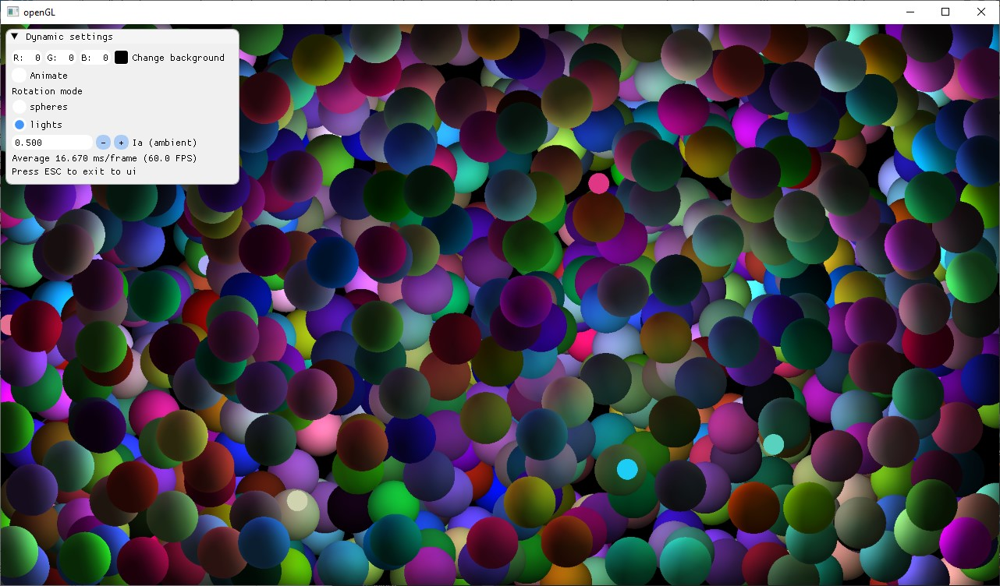
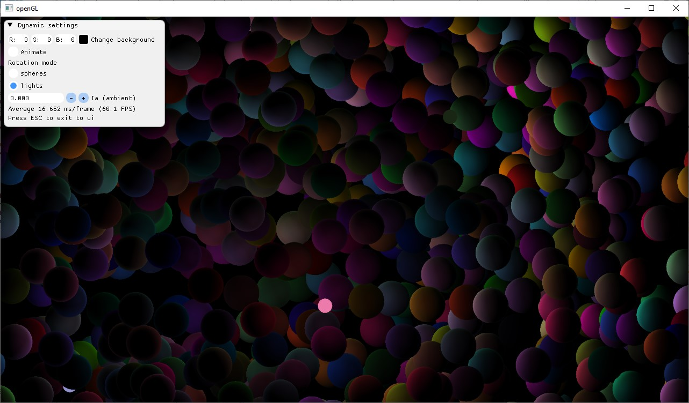
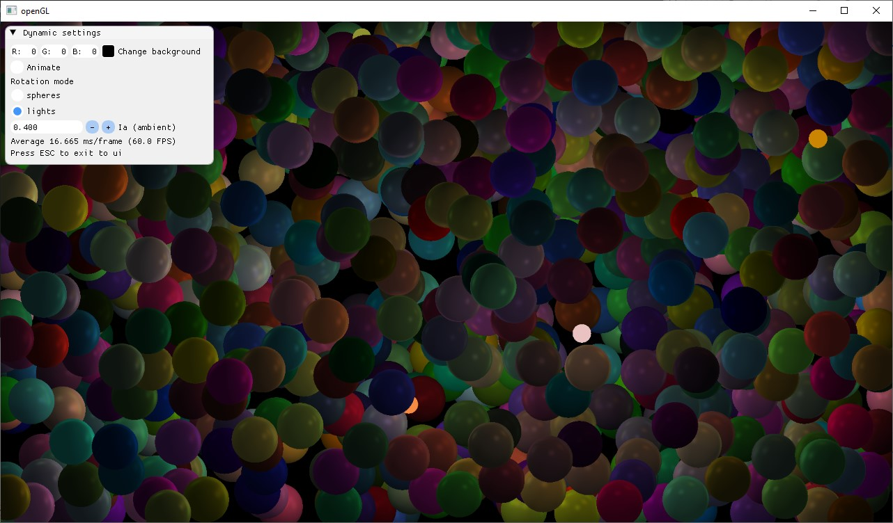
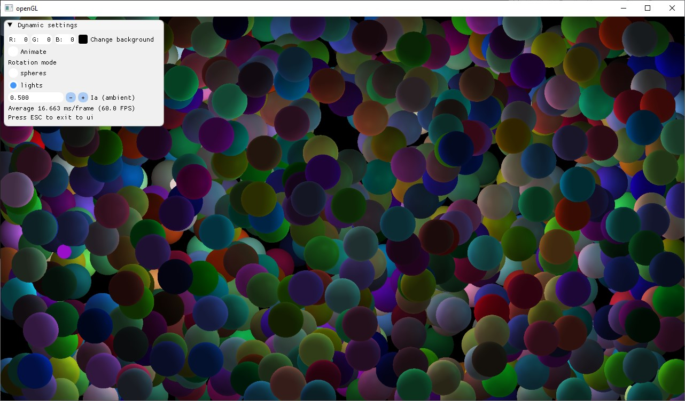

# Simple Spheres Raycasting

Simple Spheres raycasting in CUDA (rendered with openGL). 

## Parameters
Some parameters are avaliable to configure before starting the raycasting. They include
- the number of spheres
- `x, y, z` (for location) and radius values ranges
- spheres material (choice from predefined list)
- number of sources of lights
- location and radius ranges for light sources
- Phong reflection model parameters for lights (ranges)
- camera resolution (which determins the number of cast rays)

Parameters can be loaded from file within the executable 
location ([check example config in repo](./SpheresRaycasting/config.txt))

## After the start of casting
After the start of casting user has fewer options at their disposal. 

- Ambient component of Phong reflection model can be changed (value `0 - 1`)

- Animation mode can be set to rotate the lights around the center of the scene with time.

- User can select to rotate the light sources or the spheres around the center of the scene.

- Camera movement is not possible.

## [How it works](https://en.wikipedia.org/wiki/Ray_casting#Concept)
- Rays are cast from the camera position along the Z axis and intersection with spheres in the scene are checked. 
After failing to implement LVBH myself (to be fair I didn't try particulary hard) I have used [this github project](https://github.com/ToruNiina/lbvh).
- Based on ray intersection with spheres [Phong reflection model](https://en.wikipedia.org/wiki/Phong_reflection_model) parameters and the pixel color are calculated
- Color is written to openGL texture
- Texture is render on the screen by openGL

## Examples
- matte material

- glossy material

- soft material

## Some sources
- [Nvidia Developer Technical Blog](https://developer.nvidia.com/blog): Thinking in parallel
	- [Part1](https://developer.nvidia.com/blog/thinking-parallel-part-i-collision-detection-gpu/)
	- [Part2](https://developer.nvidia.com/blog/thinking-parallel-part-ii-tree-traversal-gpu/)
	- [Part3](https://developer.nvidia.com/blog/thinking-parallel-part-iii-tree-construction-gpu/)
- [Phong reflection model](https://en.wikipedia.org/wiki/Phong_reflection_model)

## Dependencies
The project uses
- [GLFW](https://github.com/glfw/glfw) (managing windows)
- [glad](https://github.com/Dav1dde/glad) (openGL loader (and more))
- openGL
- CUDA
- [Dear imGui](https://github.com/ocornut/imgui) (controls)
- [lbvh implementation](https://github.com/ToruNiina/lbvh) by [Toru Niina](https://github.com/ToruNiina)
- [GML](https://github.com/g-truc/glm) (math)

## Build
Build in Visual Studio 2022 with CUDA support. Installation steps can be found [here](https://docs.nvidia.com/cuda/cuda-installation-guide-microsoft-windows/).

Dependencies are placed in the [Libraries](./Libraries) subdirectory or are directly part of source files. 
